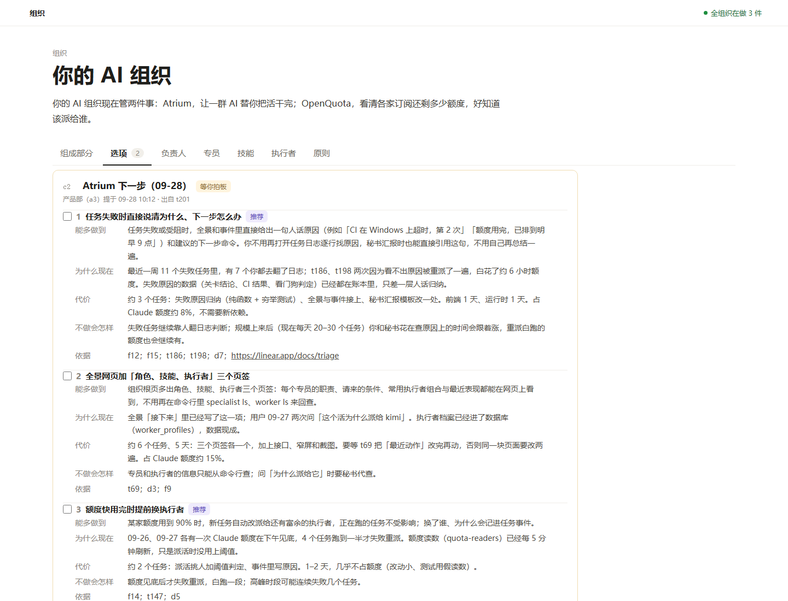
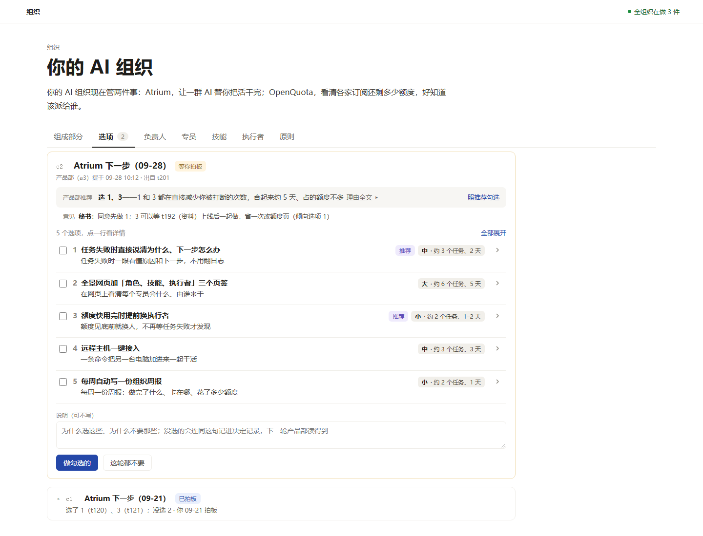

# 设计稿：全景「选项」页默认一行、点开看详情（t205）

只是设计稿，不改产品代码；用户确认后另派实现。

## 结论

- **每个选项默认只占一行半**：编号 + 标题，下面一句话（≤40 字），右侧「推荐」和代价标签（`中 · 约 3 个任务、2 天`）。点这一行才展开「能多做到 / 为什么现在 / 代价 / 不做会怎样 / 依据」；依据再折成「N 条」。
- **推荐放到单子顶部**：「产品部推荐 **选 1、3**——理由第一句」，右边「照推荐勾选」；理由全文点开看。
- **已拍板、这轮都不要的单子整份折成一行**：`c1 Atrium 下一步（09-21） 已拍板 / 选了 1（t120）、3（t121）；没选 2 · 你 09-21 拍板`。
- **研究模板加两个字段**：`summary`（一句话，≤40 字）、`size`（`small` / `medium` / `large`）+ `effort`（≤20 字，如「约 3 个任务、2 天」）。都是可选字段，旧字段不变；旧单子没有它们时，一句话退回用「能多做到」的第一句，代价不出标签。

效果：同样 5 个选项，现在一屏只放得下 c2 的前 4 个（每个都是五段长文）；新设计一屏能放下整份 c2、顶部推荐和下面折起来的 c1。

| 现在                              | 新设计（默认）               |
| --------------------------------- | ---------------------------- |
|  |  |

## 截图

| 截图                                                                                                           | 内容                                                                                   |
| -------------------------------------------------------------------------------------------------------------- | -------------------------------------------------------------------------------------- |
| [01-wide-light.png](01-wide-light.png)                                                                         | 宽屏 1440，亮色，默认状态：等拍板的单子全收起，已拍板的折成一行                        |
| [02-wide-light-expanded.png](02-wide-light-expanded.png)                                                       | 宽屏亮色，展开选项 1（含依据 6 条）、展开已拍板的 c1（旧单子，没有新字段时的退回样子） |
| [03-wide-dark.png](03-wide-dark.png)                                                                           | 宽屏暗色，默认状态                                                                     |
| [04-wide-dark-expanded.png](04-wide-dark-expanded.png)                                                         | 宽屏暗色，展开状态                                                                     |
| [05-narrow-light.png](05-narrow-light.png)                                                                     | 窄屏 390，亮色，默认状态：标签换到一句话下面                                           |
| [06-narrow-dark-expanded.png](06-narrow-dark-expanded.png)                                                     | 窄屏暗色，展开选项 1：字段名在上、内容在下                                             |
| [07-narrow-light-done-error.png](07-narrow-light-done-error.png)                                               | 窄屏亮色，出错（没勾就点「做勾选的」）+ 展开的已拍板单子                               |
| [00-before-wide-light.png](00-before-wide-light.png)、[00-before-narrow-light.png](00-before-narrow-light.png) | 现在的样子（照抄 `app.js` 现有写法、同一份样例数据），用来对比                         |

空态（这一块还没有选项单）沿用现有文案，本稿不改。

## 可点击的设计稿

设计稿用真实的 `server/map/web/style.css`，只叠一层 `choices.css`。需要从仓库根目录起一个静态服务（ES 模块不能从 `file://` 加载），例如：

```sh
npx http-server -p 4399 .
# 打开 http://127.0.0.1:4399/docs/design/t205-choices/index.html
```

可以点：每一行展开收起、「全部展开」、「照推荐勾选」、「理由全文」、依据「N 条」、已拍板单子那一行、「做勾选的」（没勾时出错提示）。

地址参数（截图用）：`?v=before` 画现在的样子，`?dark=1` 暗色，`?expand=1` 展开选项 1，`?done=1` 展开已拍板的单子，`?error=1` 演示出错。窄屏用 `frame.html?w=390&h=1400&…`（Chrome 无头窗口有最小宽度，用 iframe 开 390 宽）。

## 用户在这页要做的事，和每件事在哪做

| 要做的事                     | 在哪里                                                                     |
| ---------------------------- | -------------------------------------------------------------------------- |
| 一眼看清有几个方向、各是什么 | 选项列表：一行一个，标题 + 一句话；列表上方「5 个选项，点一行看详情」      |
| 比大小、代价                 | 每行右侧代价标签，宽屏右对齐成一列，上下好比                               |
| 知道产品部推荐哪个、为什么   | 单子顶部推荐条：「选 1、3——理由第一句」，理由全文点开                      |
| 挑出想细看的                 | 点这一行展开；想全看就「全部展开」                                         |
| 拍板                         | 每行左侧勾选框（和展开分开，点勾选框不展开）；「照推荐勾选」一键勾上推荐的 |
| 回看以前拍过的               | 已拍板的单子折成一行，写清选了哪几个、落成了哪些任务、谁哪天拍的           |

## 所有字段各有位置

| 字段                                   | 默认看得到                 | 展开后                                 |
| -------------------------------------- | -------------------------- | -------------------------------------- |
| 单子：短号、标题、状态、来自哪一块     | 是                         |                                        |
| 单子：谁提的、何时、出自哪个任务       | 是（小字一行）             |                                        |
| 来自哪一块、拍板权下放给谁             | 是（同一行，沿用现有写法） |                                        |
| 推荐（选哪几个）+ 理由第一句           | 是（顶部）                 | 理由全文                               |
| 意见（秘书、leader）                   | 是（推荐下面）             |                                        |
| 选项：编号、标题、一句话               | 是                         |                                        |
| 选项：推荐、代价档位与估计             | 是（标签）                 |                                        |
| 选项：已选 · tN / 没选 · 记为 dN       | 是（标签）                 |                                        |
| 选项：能多做到（长文）                 |                            | 是（有一句话时；旧单子一句话就取自它） |
| 选项：为什么现在、代价细节、不做会怎样 |                            | 是                                     |
| 选项：依据                             |                            | 「N 条」，再点开看短号和链接           |
| 说明输入框、两个按钮、出错提示         | 是（等拍板时）             |                                        |
| 拍板人的说明                           |                            | 已拍板单子展开后                       |

## 参考的成熟做法

- **Linear 的列表行**：一行只放标题和少量属性，属性在右侧对齐成列；点开看详情。这里的代价标签就是这样放的。
- **Notion 的折叠块（toggle）、GitHub 的 `<details>` 折叠**：长文默认收起，点标题展开，浏览器原生支持键盘（回车、空格）和读屏。实现用原生 `<details>`，不写自己的展开逻辑。
- **GitHub PR 页已合并的讨论折叠成一行摘要**：已拍板的单子同理，只留结果。

## 内容侧：研究模板怎么改

改 `server/products/brief.ts` 的交付说明与 `server/choices/model.ts` 的校验，旧字段一个不动：

```json
{
  "title": "…",
  "options": [
    {
      "title": "任务失败时直接说清为什么、下一步怎么办",
      "summary": "任务失败时一眼看懂原因和下一步，不用翻日志",
      "size": "medium",
      "effort": "约 3 个任务、2 天",
      "gain": "…",
      "why_now": "…",
      "cost": "…",
      "skip": "…",
      "basis": ["f12", "t186"]
    }
  ],
  "recommend": [1, 3],
  "why": "1 和 3 都在直接减少你被打断的次数，合起来约 5 天、占的额度不多。……"
}
```

模板里加的规矩（草稿）：

- `summary`：一句话说做了用户能多做到什么，40 字内，不写「通过……实现……」这类实现话。网页默认只显示这句。
- `size`：`small`（1–2 个任务、2 天内）/ `medium`（3–4 个任务、一周内）/ `large`（5 个任务以上或超过一周）；`effort`：20 字内的估计，如「约 3 个任务、2 天」。
- `why`：第一句就是结论（网页顶部只显示第一句），后面再展开。
- `gain`、`why_now`、`cost`、`skip` 照旧写长文，只在展开里看。

校验：`summary` ≤40 字、`size` 只认三个值、`effort` ≤20 字；三个都可选（旧文件、`choice add --file` 照样能登记），模板里写成必填。`size` 用英文值存、网页显示「小 / 中 / 大」，和状态字段的做法一致。

## 实现要点（给后续实现任务）

- `app.js` 的 `optionHtml` / `choiceHtml` 按 `mockup.js` 的新写法改；`choices.css` 并进 `style.css` 替换原「选项单」一节。
- 勾选框放在 `<summary>` 外面，点勾选框不会顺带展开。
- 网页每次刷新会整页重画：`formState` / `restoreForms` 除了勾选和说明，还要记下哪些选项、哪份单子是展开的，画完放回去，否则用户读到一半会被收起。
- 一句话的退回规则（没有 `summary` 时取 `gain` 第一句、超过 40 字截断）写成纯函数放 `format.js`，按长短、有无句号穷举测试。
- 接口 `/api/map` 带出新字段即可，不加新接口。

## 备选方案（没选的）

| 方案                                              | 好处                 | 为什么没选                                                                                    |
| ------------------------------------------------- | -------------------- | --------------------------------------------------------------------------------------------- |
| B. 对比表：选项一行、列是一句话 / 代价 / 推荐     | 横向比较最直观       | 5 段长文放不进表格；窄屏表格要降成卡片，又回到一张一张翻                                      |
| C. 手风琴：一次只能展开一个                       | 页面最短             | 想对比两个选项时要来回点；Notion、GitHub 都允许同时展开多个                                   |
| D. 左侧列表 + 右侧详情面板（邮件客户端式）        | 宽屏下读详情不跳位置 | 窄屏没地方放右栏；全景其它页都是单栏，多一种布局要多学                                        |
| E. 不加新字段，一句话全由网页截取 `gain` 前 40 字 | 不用改模板           | 截出来常是半句话（「任务失败或受阻时，全景和事件里直接给出一句人话原因（例如…」），读不出重点 |

B 可以作为以后的补充：选项单多了以后，在单子顶部加一个「对比」小表。
