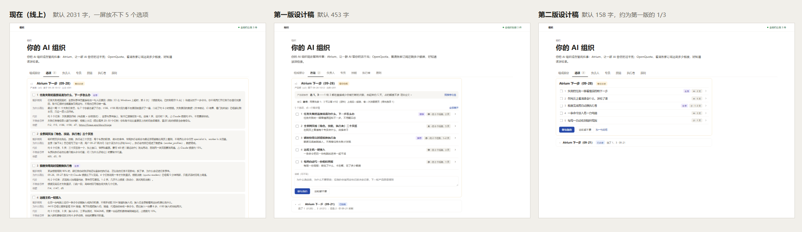

# 设计稿：全景「选项」页每个选项只占一行（t205，第二版）

只是设计稿，不改产品代码；用户确认后另派实现。第一版用户看过觉得字太多、有点复杂，这一版按 09-28 的 7 条意见改。

## 结论

- **每个选项只占一行**：勾选框、编号、标题、「推荐」、代价「中 · 2 天」、展开箭头。标题直接写做完能得到什么，下面不再另写一句。
- **点开只有三段**：能多做到（「为什么现在」并进来）、代价、不做会怎样，每段不超过两句；依据收成「N 条」。推荐的选项点开后多一行推荐理由，秘书倾向它的意见也放在这里。
- **单子头部只留标题和状态**：短号、谁提的、出自哪个任务放到悬停提示里；已拍板的单子展开后也能看到。
- **说明框默认收起**，按钮旁边一个「加一句说明」链接，点了才出来。
- **已拍板的单子整份收成一行**：`Atrium 下一步（09-21） 已拍板 选了 1、3 · 09-21`。

## 字数对照

默认状态下「选项」页签里看得到的字（不算空白），同一份 c2 加已拍板的 c1，由设计稿里的 `data-chars` 量出：

| 版本         | 默认字数 | 和第一版比 |
| ------------ | -------: | ---------: |
| 现在（线上） |     2031 |     4.5 倍 |
| 第一版设计稿 |      453 |          — |
| 第二版设计稿 |      158 |        35% |



## 7 条意见怎么落实的

| 意见                                         | 这一版                                                                                                              |
| -------------------------------------------- | ------------------------------------------------------------------------------------------------------------------- |
| ① 删头部短号和「产品部 (a3) 提于…出自 tN」   | 头部只剩标题 + 状态。出处（`c2 · 产品部（a3） 09-28 10:12 提 · 出自 t201`）悬停标题可见；已拍板单子展开后第一行显示 |
| ② 删「5 个选项，点一行看详情」和「全部展开」 | 删了。行尾的箭头已经说明能点开                                                                                      |
| ③ 删整块「产品部推荐…照推荐勾选」            | 删了。行上有「推荐」标签；推荐理由放进推荐选项的展开里                                                              |
| ④ 每行一行，标题写结果                       | 标题改写成结果（「失败的任务一眼看懂原因和下一步」），不再有第二行的一句话                                          |
| ⑤ 代价缩成「中 · 2 天」                      | 是                                                                                                                  |
| ⑥ 说明框默认收起                             | 换成「加一句说明」链接                                                                                              |
| ⑦ 展开只留 3 段、每段不超过两句，依据折叠    | 能多做到（含为什么现在）/ 代价 / 不做会怎样；依据「N 条」；研究模板同步要求写短（见下）                             |

保留：勾选框、推荐标签、两个按钮、已拍板整份折叠。

## 截图

| 截图                                                                                                           | 内容                                                                     |
| -------------------------------------------------------------------------------------------------------------- | ------------------------------------------------------------------------ |
| [00-compare.png](00-compare.png)                                                                               | 现在 / 第一版 / 第二版，宽屏 1440×1100 同一屏对照                        |
| [01-wide-light.png](01-wide-light.png)                                                                         | 宽屏亮色，默认                                                           |
| [02-wide-light-expanded.png](02-wide-light-expanded.png)                                                       | 宽屏亮色，展开选项 1（推荐理由、秘书意见、三段、依据），展开已拍板的 c1  |
| [03-wide-dark.png](03-wide-dark.png)                                                                           | 宽屏暗色，默认                                                           |
| [04-wide-dark-expanded.png](04-wide-dark-expanded.png)                                                         | 宽屏暗色，展开                                                           |
| [05-narrow-light.png](05-narrow-light.png)                                                                     | 窄屏 390 亮色，默认：标签挪到标题下面                                    |
| [06-narrow-dark-expanded.png](06-narrow-dark-expanded.png)                                                     | 窄屏暗色，展开选项 1：字段名在上、内容在下                               |
| [07-narrow-light-note-error-done.png](07-narrow-light-note-error-done.png)                                     | 窄屏亮色：没勾就点「做勾选的」的出错提示、打开的说明框、展开的已拍板单子 |
| [00-before-wide-light.png](00-before-wide-light.png)、[00-before-narrow-light.png](00-before-narrow-light.png) | 现在线上的样子（照抄 `app.js` 现有写法，同一份 c2 长文）                 |
| [00-v1-wide-light.png](00-v1-wide-light.png)                                                                   | 第一版设计稿的默认状态，留作对照                                         |

空态（这一块还没有选项单）沿用现有文案，本稿不改。

## 可点击的设计稿

用真实的 `server/map/web/style.css`，只叠一层 `choices.css`。ES 模块不能从 `file://` 加载，要从仓库根目录起一个静态服务：

```sh
npx http-server -p 4399 .
# 打开 http://127.0.0.1:4399/docs/design/t205-choices/index.html
```

能点：每一行展开收起、依据「N 条」、「加一句说明」、「做勾选的」（没勾时出错）、已拍板单子那一行；悬停单子标题看出处。

地址参数：`?v=before` 现在的样子，`?dark=1` 暗色，`?expand=1` 展开选项 1，`?done=1` 展开已拍板单子，`?note=1` 打开说明框，`?error=1` 演示出错。窄屏用 `frame.html?w=390&h=1300&…`（Chrome 无头窗口有最小宽度，用 iframe 开 390 宽）。`compare.html` 是对照图的页面。

## 所有字段各有位置

| 字段                                    | 默认看得到                   | 在哪看                                       |
| --------------------------------------- | ---------------------------- | -------------------------------------------- |
| 单子标题、状态                          | 是                           |                                              |
| 短号、谁提的、何时、出自哪个任务        |                              | 悬停标题；已拍板单子展开后第一行             |
| 选项编号、标题（写结果）                | 是                           |                                              |
| 推荐、代价档位与天数                    | 是（标签）                   |                                              |
| 已选 · tN / 没选                        | 是（已拍板单子展开后的标签） | 没选记成的 dN 在决定记录里查                 |
| 推荐理由                                |                              | 推荐选项展开后第一行                         |
| 秘书、leader 意见                       |                              | 它倾向的选项展开后；没写倾向的见「实现要点」 |
| 能多做到 + 为什么现在、代价、不做会怎样 |                              | 展开                                         |
| 依据                                    |                              | 展开后「N 条」再点                           |
| 勾选框、两个按钮                        | 是                           |                                              |
| 说明                                    |                              | 点「加一句说明」                             |
| 拍板人的说明、谁哪天拍的                | 日期在那一行                 | 已拍板单子展开                               |

## 内容侧：研究模板怎么改

改 `server/products/brief.ts` 的交付说明与 `server/choices/model.ts` 的校验：

```json
{
  "title": "Atrium 下一步（09-28）",
  "options": [
    {
      "title": "失败的任务一眼看懂原因和下一步",
      "size": "medium",
      "days": "2 天",
      "gain": "任务失败时，全景和事件里直接写一句原因和下一步命令，不用翻日志。上周 11 个失败里有 7 个你去翻了日志。",
      "cost": "3 个任务，约占 Claude 额度 8%，不加新依赖。",
      "skip": "继续靠人翻日志；任务越多，查原因和重派白跑的额度越多。",
      "basis": ["f12", "t186"]
    }
  ],
  "recommend": [1, 3],
  "why": "1 和 3 都在减少你被打断的次数，合起来 3 天。"
}
```

模板里的规矩（草稿）：

- `title`：写做完用户能得到什么，16 字内，不写实现（不要「加一个 xx 模块」）。
- `size`：`small`（1–2 个任务、2 天内）/ `medium`（3–4 个任务、一周内）/ `large`（5 个以上或超过一周）；`days`：天数估计，如「2 天」「1–2 天」，6 字内。
- `gain`：先写能多做到什么，再写为什么是现在，合起来不超过两句、80 字内。
- `cost`、`skip`：各不超过两句、60 字内。
- `why`：推荐理由，一两句、60 字内。
- `why_now`：新模板不再单独要；旧文件里有的，网页接在「能多做到」后面。

校验改动：`size` 只认三个值；`days` ≤6 字；`title` 的硬上限从 80 收到 24 字（模板写 16，留一点余量）；`gain` 120、`cost` / `skip` 80、`why` 120 字的硬上限。`why_now` 从必填改成可选，拍板后生成的任务详述里它为空就不出那一行。`size` / `days` 可选，旧文件和 `choice add --file` 照样能登记。

注意：收紧上限后，按旧模板写的长文件会登记失败。已经在库里的选项单不受影响（只在写入时校验）。

## 实现要点（给后续实现任务）

- `app.js` 的 `optionHtml` / `choiceHtml` 按 `mockup.js` 的写法改；`choices.css` 并进 `style.css` 替换原「选项单」一节。
- 勾选框放在 `<summary>` 外面，点勾选框不会顺带展开；展开用原生 `<details>`，键盘和读屏原生支持。
- 网页每次刷新整页重画：`formState` / `restoreForms` 除了勾选和说明，还要记下哪些选项、哪份单子展开着、说明框是否打开，画完放回去。
- 旧单子没有 `size` 就不出代价标签；标题长的在窄屏换行，不截断。
- 没写倾向（`prefer` 为空）的意见，设计稿里没有位置。建议放在按钮上方一行小字「秘书：…」，只在有这种意见时出现。
- 悬停提示触屏上看不到。等拍板的单子，触屏用户暂时看不到出处；如果要看，可以在展开任一选项时在底部加一行出处。
- 接口 `/api/map` 带出 `size`、`days` 即可，不加新接口。

## 这一版自己做的取舍（需要时可以改）

| 地方               | 这一版                                               | 另一种做法                                             |
| ------------------ | ---------------------------------------------------- | ------------------------------------------------------ |
| 推荐理由放哪       | 每个推荐选项展开后第一行（同一句会出现在 1 和 3 里） | 模板改成每个选项各写推荐理由；或只放在第一个推荐选项里 |
| 已拍板那一行写什么 | 「选了 1、3 · 09-21」，任务号放到展开里              | 带上任务号「选了 1（t120）、3（t121）」，多约 10 字    |
| 窄屏标签位置       | 挪到标题下面                                         | 仍放右侧，标题换两行                                   |

## 备选方案（第一版时就没选的）

| 方案                                         | 为什么没选                           |
| -------------------------------------------- | ------------------------------------ |
| 对比表：选项一行、列是能多做到 / 代价 / 推荐 | 长文放不进表格；窄屏要降成卡片       |
| 手风琴：一次只能展开一个                     | 想对比两个选项时要来回点             |
| 左侧列表 + 右侧详情                          | 窄屏没地方放右栏；全景其它页都是单栏 |

参考做法：Linear 的列表行（属性右对齐成列）、Notion 折叠块和原生 `<details>`、GitHub 把处理完的讨论收成一行。
